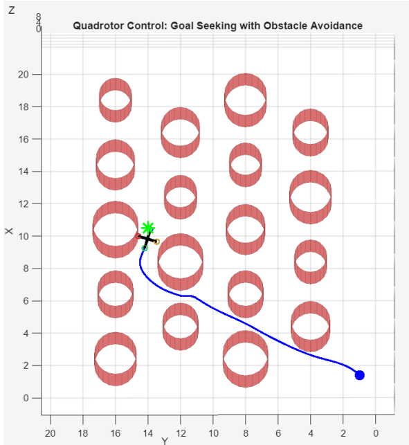

## 📈 Simulation Results

### 3D Trajectory
The optimized quadrotor trajectory in a cluttered 3D environment, showing smooth motion and safe obstacle avoidance.

  

---

### Position vs Time
Time evolution of the quadrotor position states, illustrating smoothed trajectory.

  position_time.PNG

---

### Control Inputs (normalized rotor thrust commands)
The control inputs are dimensionless thrust commands normalized around the hover equilibrium; physical thrust values in Newtons are obtained internally through the actuator model and thrust coefficient.

  Thrust_time.PNG

---

### Minimum Distance to Obstacles
Minimum signed distance between the quadrotor and nearby obstacles over time, demonstrating safe constraint satisfaction.

  distance_obs.PNG

